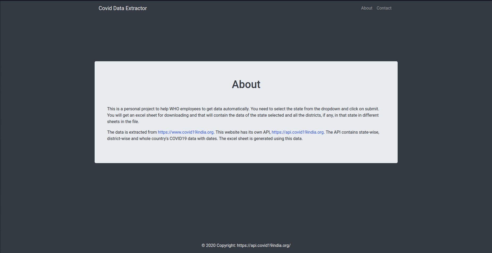

# Covid19-Data-Extractor-WHO

```
Retrieves Covid-19 Updates from api.covid19india.org API and creates excel sheet for state and district wise timeline data
```

## Introduction

This is a personal project to help people to get data automatically. You need to select the state from the dropdown and click on submit. You will get an excel sheet for downloading and that will contain the data of the state selected and all the districts, if any, in that state in different sheets in the file.

The data is extracted from https://www.covid19india.org. This website has its own API, https://api.covid19india.org. The API contains state-wise, district-wise and whole country's COVID19 data with dates. The excel sheet is generated using this data.

## Techonology

The project uses Flask for backend and Jinja2 templates for frontend. XlsxWriter library is used to write in excel file.

#### Flask

```python
from flask import Flask, render_template, request, send_from_directory
import xlsxwriter as xl
import pandas as pd
```

We extract the district data and state data using the utility functions below

```python
def extract(state: str) -> (pd.DataFrame, list):
    """
    :param state: Name of the state for extraction of the data for the state

    Getting data of respective state and its districts date wise.

    :return: Dataframe of data of respective state
    """
    global unknowns
    try:
        assert isinstance(state, str)
    except AssertionError as _:
        print("String Needed")
        raise
    print("Reading Data for districts of {}".format(state))
    # Read CSV file from covid19india API
    if state in unknowns:
        data_districts = pd.read_csv("https://api.covid19india.org/csv/latest/districts.csv", header=None, usecols=[0, 1, 3, 4, 5, 7], low_memory=False)
    else:
        data_districts = pd.read_csv("https://api.covid19india.org/csv/latest/districts.csv", header=None, usecols=[0, 1, 2, 3, 4, 5, 7], low_memory=False)
    # Get data of respective state
    data_districts_state = data_districts.loc[(data_districts[1] == state)]
    districts = []
    if state not in unknowns:
        districts = data_districts_state[2].unique()
    districts.sort()
    return data_districts_state, districts

def extract_state_data(state: str) -> pd.DataFrame:
    """
        :param state: Name of the state for extraction of the data for the state

        Getting data of respective state date wise.

        :return: Dataframe of data of respective state
        """
    try:
        assert isinstance(state, str)
    except AssertionError as _:
        print("String Needed")
        raise
    print("Reading Data for {}".format(state))
    data = pd.read_csv("https://api.covid19india.org/csv/latest/states.csv", header=None, usecols=[0, 1, 2, 3, 4, 6], low_memory=False)
    return data
```

## Run on local machine

Clone the github repository on local machine

```
git clone https://github.com/kandarpkakkad/Covid19-Data-Extractor-WHO.git
cd Covid19-Data-Extractor-WHO
```

Install the requirements

```
pip3 install -r requirements.txt
```

Run the flask app

```
python3 run extract_covid_data.py
```

## Output

#### Home Page


#### About Page



#### Contact Page


